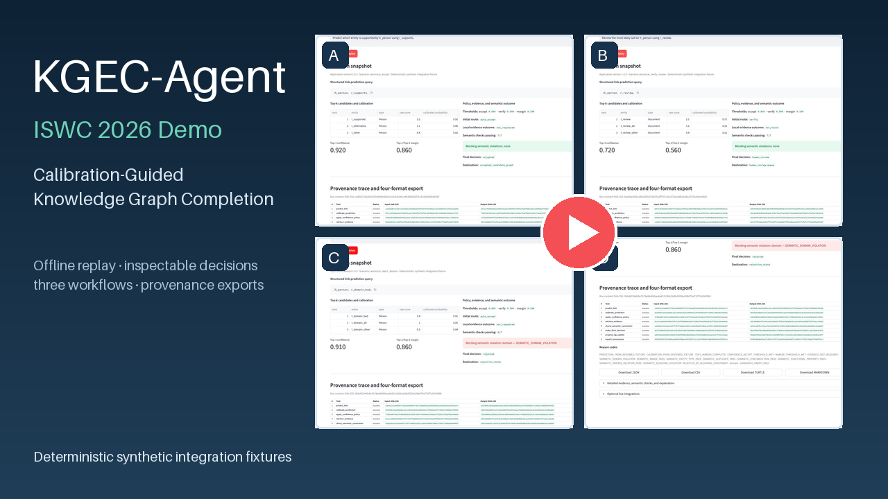
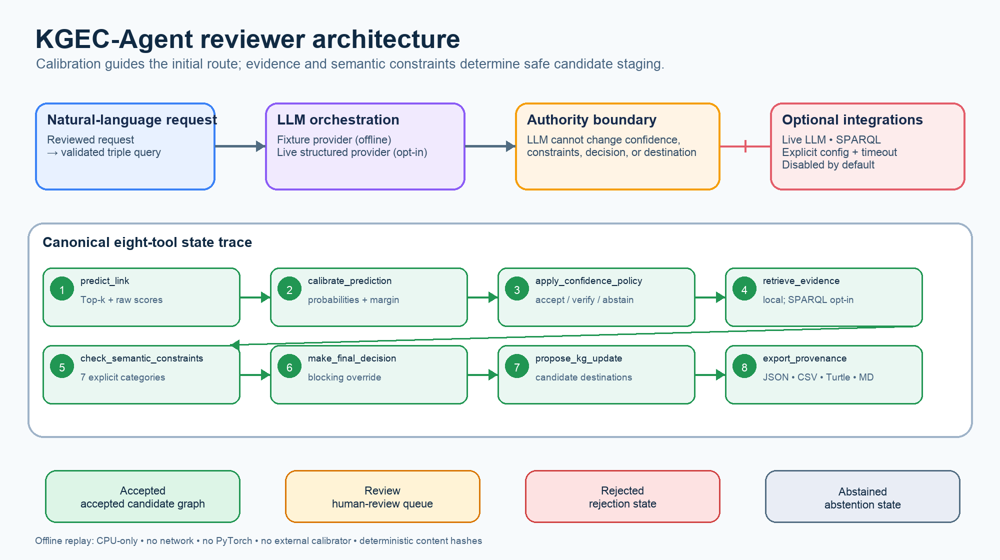
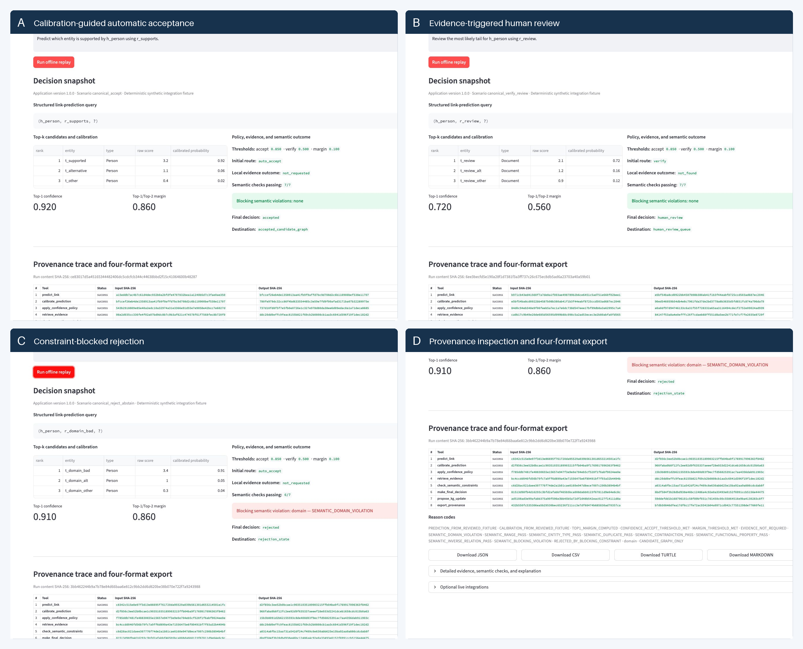

# KGEC-Agent: A Calibration-Guided Agent for Trustworthy Knowledge Graph Completion

KGEC-Agent turns calibrated link-prediction confidence into inspectable
curation actions, then uses evidence and explicit semantic checks to control
candidate-graph staging.

> **ISWC 2026 demo — version 1.0.0.** The default reviewer workflow
> is deterministic, CPU-only, network-free, and independent of live KGE or LLM
> inference.

## Demo Video

[](https://www.youtube.com/watch?v=vsk-vnGSDNE)

**[Watch the 3:51 KGEC-Agent demonstration](https://www.youtube.com/watch?v=vsk-vnGSDNE)**

The video demonstrates automatic acceptance, evidence-triggered human review,
constraint-blocked rejection, the ordered provenance trace, and JSON, CSV, RDF
Turtle, and Markdown exports. These are deterministic synthetic integration
workflows, not benchmark cases or live-model predictions.

Accessibility: [English subtitles](media/KGEC-Agent_ISWC2026_Demo.en.srt) and
[plain-text transcript](media/KGEC-Agent_ISWC2026_Demo_transcript.txt).
The complete offline replay remains available through the commands below.

## Quick Start

Python 3.11–3.13 is supported; Python 3.12 is the validated environment.

```bash
KGEC_AGENT_ENV="${TMPDIR:-/tmp}/kgec-agent-venv"
KGEC_AGENT_OUTPUT="${TMPDIR:-/tmp}/kgec-agent-output"
python3 -m venv "$KGEC_AGENT_ENV"
. "$KGEC_AGENT_ENV/bin/activate"
python -m pip install -r requirements-demo.txt
python -m pip install --no-deps .
python -m kgec_agent.demo replay \
  --scenario canonical_accept \
  --output-dir "$KGEC_AGENT_OUTPUT/canonical_accept"
```

The command prints the final decision, destination, deterministic run hash, and
paths to JSON, CSV, Turtle, and Markdown exports.

## Architecture



Calibration determines the initial `auto_accept`, `verify`, or `abstain`
route. Evidence and seven independently observable semantic checks then inform
the final decision. A blocking violation can reject a high-confidence
candidate. No route writes directly to a production knowledge graph.

## What KGEC-Agent Does

1. maps a reviewed natural-language request to a validated triple query;
2. obtains frozen Top-k predictions for stable offline replay;
3. exposes raw scores, calibrated probabilities, Top-1 confidence, and margin;
4. applies visible confidence and margin thresholds;
5. retrieves local evidence, with an optional configurable SPARQL adapter;
6. checks domain, range, entity type, duplicate, contradiction, functional
   property, and inverse relation conditions;
7. routes accepted, review, rejected, and abstained outcomes separately; and
8. exports the ordered trace with reason codes and content hashes.

The fixture LLM provider and the optional live structured provider share one
validated interface. Neither provider may set confidence, change semantic
results, or decide candidate admission.

## Three Demonstration Workflows

| Scenario | Initial route | Evidence/semantic result | Final decision | Destination |
|---|---|---|---|---|
| `canonical_accept` | `auto_accept` | no blocking violation | `accepted` | accepted candidate graph |
| `canonical_verify_review` | `verify` | local evidence `not_found`; checks pass | `human_review` | human-review queue |
| `canonical_reject_abstain` | `auto_accept` | blocking domain violation | `rejected` | rejection state |

These are transparent workflow fixtures, not scientific benchmark results or
live-model predictions.



## Offline Replay Commands

```bash
KGEC_AGENT_OUTPUT="${TMPDIR:-/tmp}/kgec-agent-output"

python -m kgec_agent.demo replay \
  --scenario canonical_accept \
  --output-dir "$KGEC_AGENT_OUTPUT/canonical_accept"

python -m kgec_agent.demo replay \
  --scenario canonical_verify_review \
  --output-dir "$KGEC_AGENT_OUTPUT/canonical_verify_review"

python -m kgec_agent.demo replay \
  --scenario canonical_reject_abstain \
  --output-dir "$KGEC_AGENT_OUTPUT/canonical_reject_abstain"
```

`--output-dir` is required, may point to any writable location, and is the only
place replay files are written.

## Streamlit Reviewer Interface

Install the demo requirements as shown above, then run:

```bash
streamlit run apps/kgec_agent_demo.py
```

The default UI never selects the live LLM or SPARQL adapters. It exposes the
request, structured query, candidate table, calibration values, thresholds,
evidence, semantic results, final destination, ordered trace, reason codes,
and four download formats.

## Sample Outputs and Provenance

Pre-generated outputs for every scenario are under
[`examples/exports/`](examples/exports/). JSON is the complete structured
record; CSV is a portable one-row summary; Turtle is valid RDF using PROV-O;
Markdown is a human-readable audit view. See
[`docs/provenance.md`](docs/provenance.md) for the vocabulary and integrity
model.

## Repository Structure

```text
apps/                         Streamlit launcher
configs/                      Public policy, LLM, evidence, and UI defaults
examples/demo_scenarios/      Reviewer scenario summaries
examples/exports/             Deterministically generated four-format examples
figures/                      Architecture, composite, and canonical screenshots
src/kgec_agent/               Installable replay, tools, integrations, UI, schemas
tests/public_release/         Offline, semantic, export, manifest, and UI tests
scripts/                      Manifest generator and fail-closed validator
docs/                         Reviewer and reproducibility guides
```

## Live LLM and SPARQL Integrations

The default does not need credentials or network access. The
`LiveStructuredLLMProvider` is an explicitly selected OpenAI-compatible
structured-output path with schema validation, timeout handling, and
environment-only credentials. `SPARQLEvidenceSource` accepts a configured
endpoint, constructs a bounded query, parses SPARQL JSON, and normalizes
supporting, contradicting, not-found, unavailable, and malformed-response
outcomes. All integration tests use injected mock transports.

Configuration and safety boundaries are in
[`docs/live_integrations.md`](docs/live_integrations.md).

## Reproducibility

The three fixtures, eight-tool order, seven semantic categories, policy
thresholds, stable event ordering, and canonical serialization are versioned.
Run the full release validation with:

```bash
python -m pip install '.[ui,dev]'
PYTHONDONTWRITEBYTECODE=1 python -m pytest -p no:cacheprovider tests/public_release
python scripts/validate_public_release.py
```

Clean-room commands, expected results, limitations, and checksum rules are in
[`docs/reproducibility.md`](docs/reproducibility.md).

## Paper and Citation

This repository accompanies the ISWC 2026 demo submission:
**“KGEC-Agent: A Calibration-Guided Agent for Trustworthy Knowledge Graph
Completion.”** Manuscript source and PDF are intentionally not included in
this repository. Citation metadata is provided in
[`CITATION.cff`](CITATION.cff).

## Authors

1. Yang Yang
2. Yinan Liu
3. Edward Curry

## Licence

Original KGEC-Agent implementation code is released under the
[MIT Licence](LICENSE). Direct dependency and project-asset notices are in
[`THIRD_PARTY_NOTICES.md`](THIRD_PARTY_NOTICES.md).
