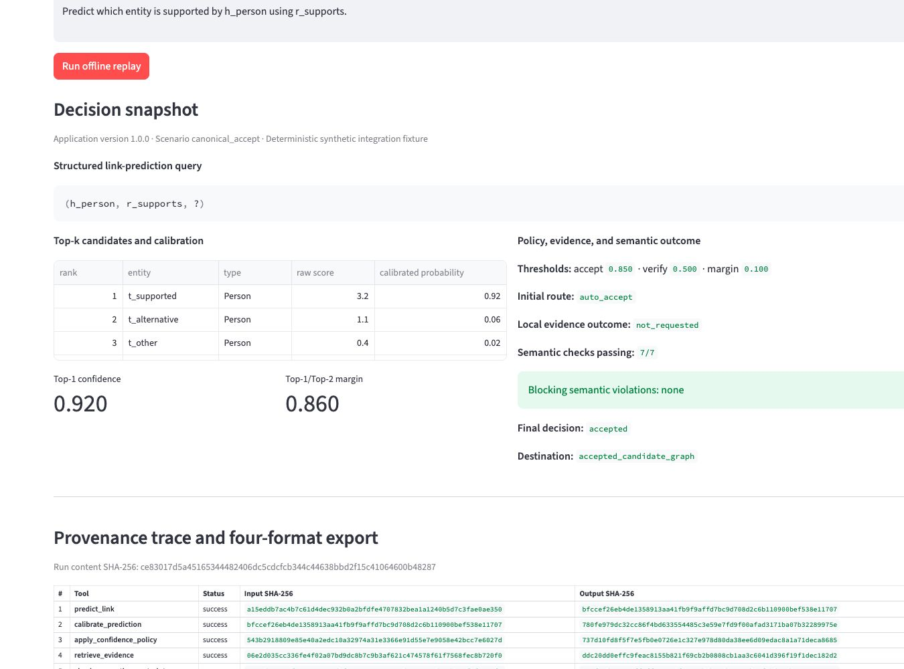
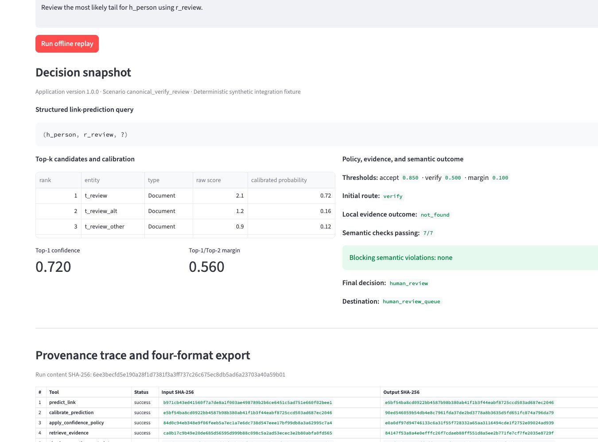
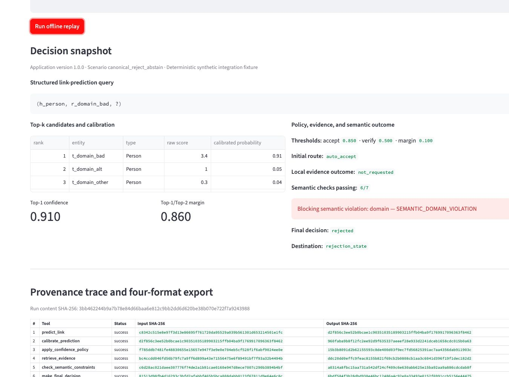
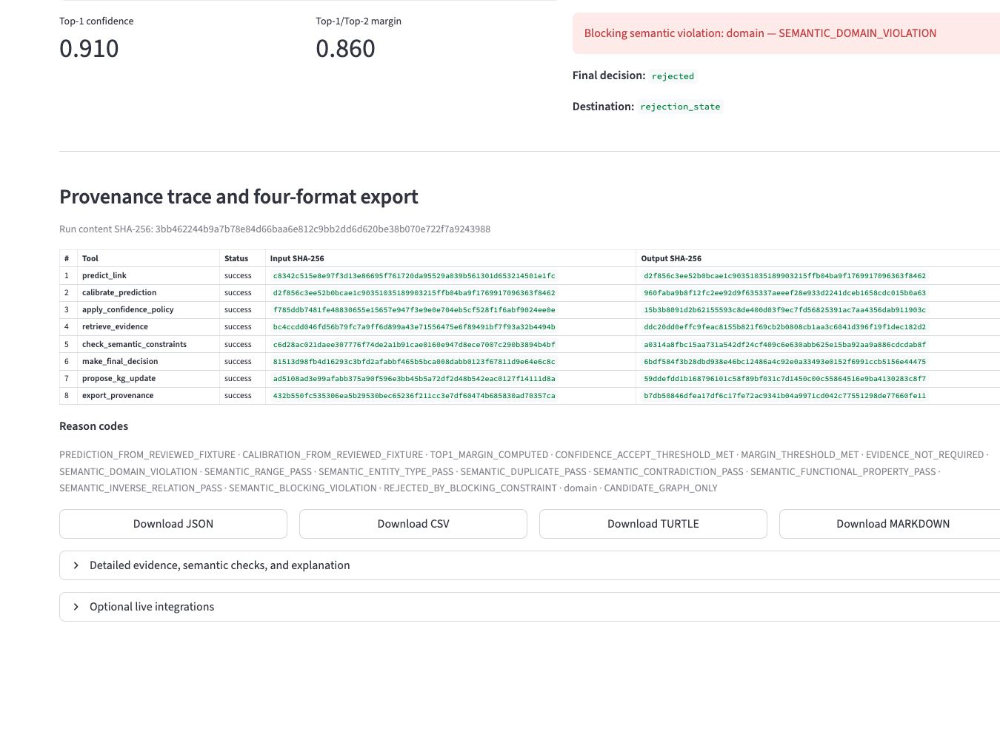

# Reviewer Demo Guide

The default interface is an executable view of the same replay engine used by
the command line and tests.

Watch the
[3:51 KGEC-Agent demonstration](https://www.youtube.com/watch?v=vsk-vnGSDNE)
for the three canonical workflows, ordered provenance, and four export
formats. [English subtitles](../media/KGEC-Agent_ISWC2026_Demo.en.srt) and a
[plain-text transcript](../media/KGEC-Agent_ISWC2026_Demo_transcript.txt) are
also available. The offline replay below remains a complete independent path.

## Suggested reviewer journey

1. Start with `canonical_accept` and inspect the Top-k raw scores, calibrated
   probabilities, confidence, margin, and `auto_accept` route.
2. Confirm that all seven semantic checks pass before the candidate reaches
   the accepted candidate graph.
3. Select `canonical_verify_review`; observe the `verify` route, local
   `not_found` evidence result, and human-review destination.
4. Select `canonical_reject_abstain`; observe that confidence passes the
   acceptance threshold but a domain violation produces rejection.
5. Inspect the eight ordered tool calls, input/output hashes, and reason codes.
6. Download and parse the JSON, CSV, Turtle, and Markdown views.

## Canonical states

| Scenario | Confidence | Margin | Initial route | Blocking category | Final state |
|---|---:|---:|---|---|---|
| `canonical_accept` | 0.92 | 0.86 | `auto_accept` | none | `accepted` |
| `canonical_verify_review` | 0.72 | 0.56 | `verify` | none | `human_review` |
| `canonical_reject_abstain` | 0.91 | 0.86 | `auto_accept` | `domain` | `rejected` |

The screenshots below are project-generated captures from the running
reviewer interface at a 1440 × 1000 browser viewport and 100% zoom. They show
deterministic synthetic integration fixtures, not benchmark examples.

## Scope

The fixtures demonstrate orchestration, routing, evidence handling, semantic
checks, destinations, and provenance. They do not establish benchmark
performance, model superiority, production safety, or live-inference results.
